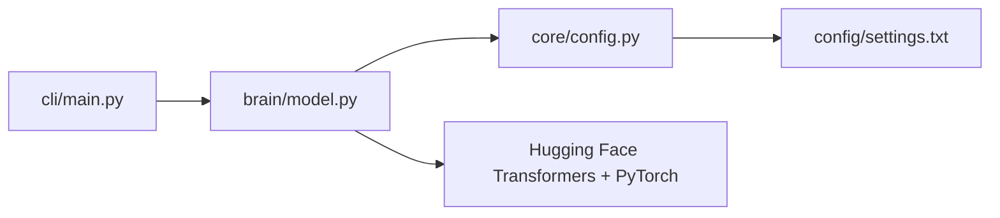

# Zoe AI — Project Audit

**Date:** 2026-07-24  
**Scope:** Repository hygiene and Sprint 1.2 readiness (no new features)

---

## Current Architecture

Zoe AI v0.1 is a small, layered Python project with three code packages and flat configuration.

```
zoe-ai/
├── brain/          # Hugging Face model load + chat generation
├── cli/            # Typer CLI (chat, train, ingest)
├── core/           # Shared config loader (pathlib-based ROOT)
├── config/         # settings.txt (key=value runtime config)
├── data/
│   ├── notes/      # User notes (about_me.md)
│   └── pdfs/       # Planned PDF ingestion target
├── docs/           # Personality and capability specs
├── storage/
│   └── chroma/     # Planned vector DB location
└── requirements.txt
```

### Data flow



1. **CLI** (`cli/main.py`) exposes `chat`, `train`, and `ingest` via Typer.
2. **Brain** (`brain/model.py`) loads `MODEL_NAME` from settings, lazily loads the model, and generates chat replies.
3. **Core** (`core/config.py`) resolves `ROOT` with `pathlib` and parses `config/settings.txt`.
4. **Docs/data** hold personality, capabilities, and user notes — not wired into runtime yet.

### Runtime dependencies in use today

| Package        | Used by              |
|----------------|----------------------|
| typer          | CLI                  |
| transformers   | Model load/generate  |
| torch          | Model inference      |
| core/config    | Settings loader      |

### Planned but not implemented

Settings keys `MEMORY_DB`, `PDF_FOLDER`, and `NOTES_FOLDER` plus deps `chromadb`, `sentence-transformers`, and `pypdf` are reserved for future memory/RAG/PDF work.

---

## Problems Found

### Critical

| # | Problem | Location |
|---|---------|----------|
| 1 | **`torch` missing from requirements.txt** | `requirements.txt` — `brain/model.py` imports `torch` directly |
| 2 | **No `__init__.py` files** | `brain/`, `cli/`, `core/` — packages not importable reliably |
| 3 | **Fragile imports when running `python cli/main.py`** | `cli/main.py` — `sys.path[0]` is `cli/`, so `from brain.model` fails unless run from repo root via `-m` |

### Moderate

| # | Problem | Location |
|---|---------|----------|
| 4 | **No type hints** | All `.py` files — PEP 8 / 3.12+ convention not followed |
| 5 | **Settings paths not anchored to ROOT** | `config/settings.txt` — relative paths (`storage/chroma`, `data/pdfs`) will break if cwd changes |
| 6 | **Referenced directories missing** | `storage/chroma/`, `data/pdfs/` — listed in settings but did not exist in repo |
| 7 | **No packaging metadata** | No `pyproject.toml` — no installable entry point or version pinning |
| 8 | **Unused requirements** | `python-dotenv`, `requests`, `tqdm`, `rich` — not referenced in code (some are Typer/transitive deps) |

### Minor / organizational

| # | Problem | Location |
|---|---------|----------|
| 9 | **`config/` vs `core/config.py` naming** | Two “config” concepts: data folder vs loader module — easy to confuse |
| 10 | **System prompt hardcoded in model layer** | `brain/model.py` — personality lives in `docs/personality.md` but is not loaded |
| 11 | **No tests or CI** | Project root |
| 12 | **README minimal** | No install/run instructions for Colab or local GPU |

### Empty placeholder files

**None found.** All tracked files contain content. The `train` and `ingest` CLI commands are stub implementations (print placeholders), not empty files.

### Duplicate responsibilities

| Area | Overlap | Verdict |
|------|---------|---------|
| `core/config.py` vs `config/settings.txt` | Loader vs data | OK — clear separation |
| `brain/model.py` | Model load + generation + system prompt | Acceptable at v0.1; split later if personality/RAG modules grow |
| `docs/personality.md` vs inline system prompt | Same intent, two sources | Document only today — consolidate in a future sprint |

### Incorrect imports

| Import | File | Issue |
|--------|------|-------|
| `from brain.model import ...` | `cli/main.py` | Fails unless repo root is on `PYTHONPATH` |
| `from core.config import ...` | `brain/model.py` | Same — requires root on path |
| `from transformers import ...` | `brain/model.py` | Correct, but heavy import at module load |

---

## Recommended Fixes

### Applied in this audit (Sprint 1.2 prep)

1. Added `__init__.py` to `brain/`, `cli/`, and `core/`.
2. Added `sys.path` bootstrap in `cli/main.py` so `python cli/main.py chat` works from repo root.
3. Added `torch` to `requirements.txt` and grouped deps by purpose.
4. Added type hints and focused docstrings to `core/config.py`, `brain/model.py`, and `cli/main.py`.
5. Switched config file read to `Path.open()` (pathlib convention).
6. Created `data/pdfs/.gitkeep` and `storage/chroma/.gitkeep` for paths referenced in settings.

### Deferred to later sprints (not implemented)

| Priority | Recommendation |
|----------|----------------|
| High | Add `pyproject.toml` with `[project.scripts]` entry point (`zoe = cli.main:app`) |
| High | Resolve settings paths relative to `ROOT` in `load_settings()` or a dedicated helper |
| High | Load system prompt from `docs/personality.md` instead of hardcoding |
| Medium | Pin dependency versions for reproducible Colab/local installs |
| Medium | Add `.env` support via `python-dotenv` (already in requirements) |
| Medium | Add minimal smoke tests (`pytest`) for config loading and CLI help |
| Low | Rename `config/` → `settings/` or document the naming convention in README |
| Low | Expand README with Colab notebook snippet and local CUDA setup |

### Colab compatibility notes

```python
# Colab bootstrap (recommended in notebook first cell)
import sys
from pathlib import Path
ROOT = Path("/content/zoe-ai")  # or clone path
sys.path.insert(0, str(ROOT))
```

Then run: `!python -m cli.main chat` or import `brain.model` after path setup.

### Local GPU notes

Current model config uses `torch.float16` and `device_map="auto"` — suitable for CUDA GPUs and Colab T4/A100. CPU-only fallback is not configured (would need explicit `device` handling in a future sprint).

---

## Files Changed

| File | Change |
|------|--------|
| `brain/__init__.py` | **Added** — package marker |
| `cli/__init__.py` | **Added** — package marker |
| `core/__init__.py` | **Added** — package marker |
| `core/config.py` | Type hints, docstrings, `Path.open()` |
| `brain/model.py` | Type hints, docstrings, import order (PEP 8) |
| `cli/main.py` | Type hints, docstrings, `sys.path` bootstrap |
| `requirements.txt` | Added `torch`, grouped and commented deps |
| `data/pdfs/.gitkeep` | **Added** — preserve planned PDF folder |
| `storage/chroma/.gitkeep` | **Added** — preserve planned vector DB folder |
| `PROJECT_AUDIT.md` | **Added** — this report |

### Unchanged (by design)

- `config/settings.txt` — values verified; paths valid for future use
- `docs/*`, `data/notes/about_me.md`, `README.md`, `.gitignore`
- CLI commands, model behavior, and generation parameters

---

## Sprint 1.2 Readiness

The repository is structurally sound for Sprint 1.2 work (memory, RAG, PDF ingestion):

- Packages are properly marked and importable.
- Critical missing dependency (`torch`) is declared.
- Referenced storage/data paths exist in the tree.
- Type hints and docstrings establish conventions for new modules.
- No features were added; CLI and model behavior are unchanged.

**Suggested next sprint order:** packaging (`pyproject.toml`) → path resolution helper → PDF ingest module → memory/RAG modules wired to existing settings keys.
