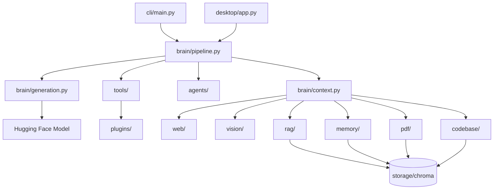

# Zoe AI

My personal AI assistant — a local-first LLM with notes, memory, PDF, code, web, and vision capabilities.

Version: v2.11

## Voice assistant (offline)

Enable voice in **Settings → Voice** (requires `pip install -r requirements-voice.txt`), then use the microphone button or **Ctrl+Shift+V** to enable push-to-talk.

- **Space** — push to talk (when focus is not in the text box)
- **Esc** — stop speaking
- Pipeline: microphone → Whisper → `brain.pipeline.generate_response()` → pyttsx3

## Zoe Desktop (primary UI)

```bash
python desktop/app.py
```

The desktop UI calls the existing backend (`brain.pipeline.generate_response`, vision pipeline, indexers, doctor) on background threads. The CLI remains fully supported.

Zoe AI is built around a Hugging Face chat model with tool routing, multiple retrieval layers backed by ChromaDB, web search, and vision analysis.



### Request flow

1. **Memory detection** — personal statements are saved before generation.
2. **Tool execution** — calculator, datetime, and filesystem requests are handled without the LLM (via the plugin registry).
3. **Project analysis** — analysis queries trigger plan → execute → gather context.
4. **Vision routing** — image queries analyze the referenced file via OCR + captioning.
5. **Context retrieval** — the plugin registry and router select memory, notes, PDF, code, or web.
6. **Generation** — the LLM replies using system context, conversation history, and the user message.

## Folder Structure

| Folder | Responsibility |
|--------|----------------|
| `brain/` | Model loading, context building, chat pipeline, and generation |
| `deployment/` | Config profiles, startup/shutdown, health, benchmarks, local telemetry |
| `desktop/` | PySide6 desktop UI and voice controls |
| `voice/` | Offline voice capture, Whisper STT, pyttsx3 TTS, local commands |
| `cli/` | Terminal commands: `chat`, `ingest`, `code`, `image`, `doctor`, `history`, `train` |
| `core/` | Shared config, Chroma helpers, logging, indexing utilities |
| `rag/` | Personal notes loading, embedding, indexing, and search |
| `memory/` | Memory detection, storage, retrieval, intelligence pipeline |
| `pdf/` | PDF loading, chunking, indexing, and search |
| `codebase/` | Source code loading, chunking, indexing, and search |
| `web/` | DuckDuckGo search, webpage reading, caching, and retrieval |
| `vision/` | Image loading, OCR, captioning, and unified vision pipeline |
| `tools/` | Tool routing facade; delegates matching routes to `plugins/` |
| `plugins/` | Plugin registry, discovery, lifecycle, permissions, builtin and drop-in community/local plugins |
| `agents/` | Supervisor, specialist agents, intent, planning, execution, recovery, verification |
| `config/` | Runtime settings (`settings.txt`) and YAML deployment profiles |
| `data/` | Notes and PDF input files |
| `scripts/` | Standalone smoke and integration test scripts |
| `tests/` | Pytest test suite |
| `docs/` | Architecture, roadmap, and status documentation |

### Brain module layout

| File | Responsibility |
|------|----------------|
| `brain/model.py` | Public API entry point (re-exports) |
| `brain/pipeline.py` | Overall chat request flow |
| `brain/context.py` | Context building and retrieval |
| `brain/generation.py` | Model loading and text generation |

## How to Install

1. Clone the repository:

```bash
git clone https://github.com/dakxhie/zoe.git
cd zoe
```

2. Create and activate a virtual environment:

```bash
python -m venv venv
# Windows
venv\Scripts\activate
# macOS / Linux
source venv/bin/activate
```

3. Install dependencies:

```bash
pip install -r requirements.txt
```

Optional offline voice (microphone, Whisper, TTS):

```bash
pip install -r requirements-voice.txt
```

PyAudio is **not** required. Zoe captures audio with `sounddevice`. Install PyAudio only if you use other SpeechRecognition microphone backends.

4. Configure settings in `config/settings.txt` (especially `MODEL_NAME`).

## How to Chat

Start an interactive session from the repository root:

```bash
python cli/main.py chat
```

Type your message and press Enter. Type `exit` or `quit` to leave.

Examples:

- `What is my favorite color?` → memory retrieval
- `Summarize Chapter 2.` → PDF retrieval
- `Find generate_response().` → code retrieval
- `Latest Python news` → web retrieval
- `Describe screenshot.png` → vision analysis

## Extending tools (plugins)

Zoe ships **builtin** routing plugins (memory, web, PDF, code, notes, calculator, datetime) and optional **manifest extensions** under `plugins/<name>/` with `plugin.json` and `main.py`. Extensions are **disabled by default**; enable them without restarting Zoe:

```bash
python cli/main.py plugins list
python cli/main.py plugins enable clock
python cli/main.py plugins reload clock
```

Extension code must use `PluginContext` only (`register_tool`, hooks, `storage()`, `logger()`). Legacy single-file plugins in `plugins/local/` still work. See `plugins/example_clock/` and `docs/ARCHITECTURE.md`.

## Production deployment

Configuration priority: **CLI overrides → environment variables → YAML (`config/*.yaml`) → `config/settings.txt`**.

```bash
# Profiles via environment
set ZOE_PROFILE=production
set ZOE_LOG_LEVEL=INFO

python scripts/install.py
python scripts/doctor.py
python scripts/benchmark.py
python scripts/export_settings.py data/exports/my-zoe
python scripts/import_settings.py data/exports/my-zoe
```

Startup runs through `deployment.startup.run_startup_sequence()` (CLI chat and desktop). Local telemetry is stored under `data/telemetry/` and is never uploaded. See `docs/ARCHITECTURE.md`.

## How to Index PDFs

Place PDF files in `data/pdfs/`, then run:

```bash
python cli/main.py ingest
```

This builds both the notes index and the PDF index.

## How to Index Code

```bash
python cli/main.py code .
```

Replace `.` with any project path.

## How to Analyze Images

Direct mode (no LLM):

```bash
python cli/main.py image photo.jpg
```

With a question:

```bash
python cli/main.py image screenshot.png --prompt "Explain the error."
```

In chat:

```bash
python cli/main.py chat
# Then: Describe screenshot.png
```

## How Memory Works

1. **Detection** — `memory/detector.py` and `memory/inference.py` decide what is worth remembering.
2. **Intelligence** — `memory/intelligence/` scores importance, reinforces repeats, merges duplicates, and filters trivial chat.
3. **Storage** — scored memories persist in `zoe_memory` via `memory/store.py` (importance, confidence, frequency, category metadata).
4. **Profile** — an internal user profile is rebuilt during review (`profile_builder.py`); ask *What do you know about me?* or *What have you learned?* for a summary.
5. **Retrieval** — memory-related queries are routed to the memory tool.
6. **Post-turn review** — after each reply, `agents/orchestrator.finalize_conversation_memory()` runs consolidation and review.
7. **Conversation history** — persistent dialogue is stored in `data/history/chat.jsonl`, indexed in `zoe_history`, and the last 20 messages are included in prompts via `conversation/`.

## Conversation History

Persistent dialogue is separate from long-term memory facts.

| Component | Location |
|-----------|----------|
| Raw messages | `data/history/chat.jsonl` |
| Session id | `data/history/session.json` |
| Summary | `data/history/summary.json` |
| Semantic index | Chroma collection `zoe_history` |

CLI commands:

```bash
python cli/main.py history
python cli/main.py history sessions
python cli/main.py history summary
python cli/main.py history clear
python cli/main.py history stats
```

Summarization runs automatically after 40 messages using the local LLM. Prompts use the latest summary plus the 20 most recent raw messages.

## How Tools Work

The tool router (`tools/router.py`) classifies queries into: `chat`, `memory`, `notes`, `pdf`, `code`, `web`, `vision`, or `filesystem`.

| Tool | Examples |
|------|----------|
| Calculator | `2+2`, `10*(5+2)` |
| Datetime | `Current time`, `Today's date`, `What time is it in India?`, `UTC time` |
| Filesystem | `list files`, `read file README.md` |
| Web | `latest news`, `current weather` |
| Vision | `describe image.jpg`, `read receipt.png` |

## How Planners Work

For project analysis and multi-tool requests, the agent layer analyzes intent, builds an internal plan, executes tools with recovery, fuses ranked context, verifies quality, then generates the answer. Project analysis still runs: search code → read files → gather context → summarize → recommend, with an added structured project report.

For complex questions, an internal **Supervisor** selects specialist agents (memory, research, coding, reasoning, creative). They run in parallel when safe, merge structured findings by confidence, and feed one brief into the same LLM turn. The user still sees a single Zoe reply.

For long-running goals (for example full project analysis), an **autonomous task engine** plans internal subtasks (index → detect framework → architecture → code review → summarize), tracks progress, and returns one consolidated report. Simple prompts (`2+2`, greetings, time/weather) bypass this engine.

## How to Run Tests

### Regression (release verification)

End-to-end functional checks against the real Zoe stack (not a pytest replacement):

```bash
python tests/regression.py          # quick suite
python tests/regression.py --full   # indexes, web, vision, imports, performance
```

Results print to the terminal and to `tests/reports/latest.txt`.

### Pytest

```bash
pytest tests/ -v
```

#### Desktop (Qt) tests

Desktop and voice widget tests need PySide6 and a display. On **headless** environments (GitHub Actions, Google Colab, Linux without `DISPLAY`, WSL without an X server), those tests are **skipped automatically** — they never create `QApplication`, so Qt cannot abort the process.

To force GUI tests on a machine that would otherwise be treated as headless:

```bash
export ZOE_FORCE_GUI_TESTS=1
pytest tests/ -v
```

On Linux with no physical display but with offscreen Qt support:

```bash
export QT_QPA_PLATFORM=offscreen
pytest tests/ -v
```

#### Voice tests

Optional voice packages live in `requirements-voice.txt`. Tests that need Whisper, `sounddevice`, or `pyttsx3` **skip** when those packages are missing; they do not fail the suite.

#### Expected skips in CI

Typical GitHub Actions summary:

- Desktop / Qt tests (headless runner)
- Optional voice hardware tests when `requirements-voice.txt` is not installed

Everything else should **pass**.

### Script smoke tests

```bash
python cli/main.py doctor
python scripts/system_check.py
python scripts/test_web_pipeline.py
python scripts/test_vision_pipeline.py
python scripts/test_chat_vision.py
```

## How CI Works

GitHub Actions (`.github/workflows/tests.yml`) runs `pytest tests/ -q` on every push and pull request. GUI tests skip on headless runners (`CI=true`).

## Goals

- Friend-like conversations
- Coding assistant
- Teaching assistant
- Research assistant
- PDF knowledge
- Long-term memory
- Web research
- Image understanding
