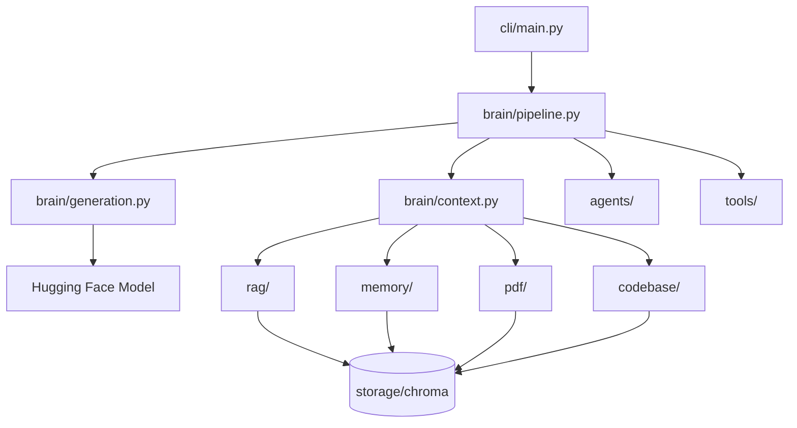

# Zoe AI

My personal AI assistant — a local-first LLM with notes, memory, PDF, code retrieval, and lightweight tools.

Version: v0.1

## Project Architecture

Zoe AI is built around a Hugging Face chat model with multiple retrieval layers backed by ChromaDB. The chat pipeline routes each user message through memory detection, tool execution, optional project analysis, context retrieval, and LLM generation.



### Request flow

1. **Memory detection** — personal statements are saved before generation.
2. **Tool execution** — calculator, datetime, and filesystem requests are handled without the LLM.
3. **Project analysis** — analysis queries trigger plan → execute → gather context.
4. **Context retrieval** — the router selects one source: notes, memory, PDF, or code.
5. **Generation** — the LLM replies using system context, conversation history, and the user message.

## Folder Structure

| Folder | Responsibility |
|--------|----------------|
| `brain/` | Model loading, context building, chat pipeline, and generation |
| `cli/` | User commands: `chat`, `ingest`, `code`, `train` |
| `core/` | Shared config, Chroma helpers, logging, indexing utilities |
| `rag/` | Personal notes loading, embedding, indexing, and search |
| `memory/` | Memory detection, storage, retrieval, and conversation history |
| `pdf/` | PDF loading, chunking, indexing, and search |
| `codebase/` | Source code loading, chunking, indexing, and search |
| `tools/` | Tool routing, calculator, datetime, and filesystem tools |
| `agents/` | Project analysis planner and executor |
| `config/` | Runtime settings in `settings.txt` |
| `data/` | Notes and PDF input files |
| `scripts/` | Standalone smoke and integration test scripts |
| `tests/` | Pytest test suite |
| `docs/` | Architecture and roadmap documentation |

### Brain module layout

| File | Responsibility |
|------|----------------|
| `brain/model.py` | Public API entry point (re-exports) |
| `brain/pipeline.py` | Overall chat request flow |
| `brain/context.py` | Context building and retrieval |
| `brain/generation.py` | Model loading and text generation |

## How to Install

1. Clone the repository:

```bash
git clone https://github.com/dakxhie/zoe.git
cd zoe
```

2. Create and activate a virtual environment:

```bash
python -m venv venv
# Windows
venv\Scripts\activate
# macOS / Linux
source venv/bin/activate
```

3. Install dependencies:

```bash
pip install -r requirements.txt
```

4. Configure settings in `config/settings.txt` (especially `MODEL_NAME`).

## How to Chat

Start an interactive session from the repository root:

```bash
python cli/main.py chat
```

Type your message and press Enter. Type `exit` or `quit` to leave.

Zoe remembers personal statements, routes retrieval automatically, and handles simple tools (math, date/time, filesystem) without loading the LLM.

## How to Index PDFs

Place PDF files in `data/pdfs/`, then run:

```bash
python cli/main.py ingest
```

This builds both the notes index and the PDF index. PDF chunks are stored in the `zoe_documents` ChromaDB collection.

## How to Index Code

Index a project's source code:

```bash
python cli/main.py code .
```

Replace `.` with any project path. Code chunks are stored in the `zoe_code` collection and searched when Zoe routes a query to the code tool.

## How Memory Works

1. **Detection** — `memory/detector.py` decides whether a message contains personal information worth storing.
2. **Storage** — accepted messages are saved to the `zoe_memory` ChromaDB collection via `memory/store.py`. Exact duplicates are skipped.
3. **Retrieval** — during chat, memory-related queries are routed to the memory tool and relevant memories are injected into the system context.
4. **Conversation history** — the last 10 in-memory messages (FIFO) are included in each LLM prompt via `memory/history.py`.

When Zoe saves a personal statement, she replies with: *"Got it. I'll remember that."*

## How Tools Work

The tool router (`tools/router.py`) classifies each query into one of: `chat`, `memory`, `notes`, `pdf`, `code`, or `filesystem`.

The executor (`tools/executor.py`) handles lightweight requests before the LLM:

| Tool | Examples |
|------|----------|
| Calculator | `2+2`, `10*(5+2)` |
| Datetime | `Current time`, `Today's date` |
| Filesystem | `list files`, `read file README.md`, `find file model.py`, `search text generate_response` |

Filesystem tools are read-only and skip sensitive directories (`.git`, `venv`, `storage`, etc.).

## How Planners Work

For project analysis queries (e.g. *"Analyze this Python project and tell me how to improve it"*), the agent layer runs a fixed plan:

1. Search code
2. Read important files
3. Gather context
4. Summarize
5. Recommend improvements

`agents/planner.py` detects the query and returns the plan. `agents/executor.py` searches indexed code and reads key project files. `agents/analyzer.py` orchestrates both and passes gathered context to the LLM instead of normal retrieval.

## How to Run Tests

### Pytest (recommended)

```bash
pytest tests/ -v
```

### Standalone script tests

Existing scripts in `scripts/` remain available:

```bash
python scripts/test_tool_router.py
python scripts/test_tools.py
python scripts/test_history.py
python scripts/test_project_analyzer.py
python scripts/full_system_test.py
```

### System check

Verify all subsystems in one pass:

```bash
python scripts/system_check.py
```

Each subsystem prints `PASS` or `FAIL`. The script ends with `System Ready`.

## How CI Works

GitHub Actions runs on every push and pull request (`.github/workflows/tests.yml`):

1. Checks out the repository
2. Sets up Python 3.12
3. Installs `requirements.txt`
4. Runs `pytest tests/ -v`

CI tests do not load the Hugging Face model — they cover routing, tools, filesystem, history, memory detection, project analysis, and the retrieval pipeline via mocks.

## Goals

- Friend-like conversations
- Coding assistant
- Teaching assistant
- Research assistant
- PDF knowledge
- Long-term memory
