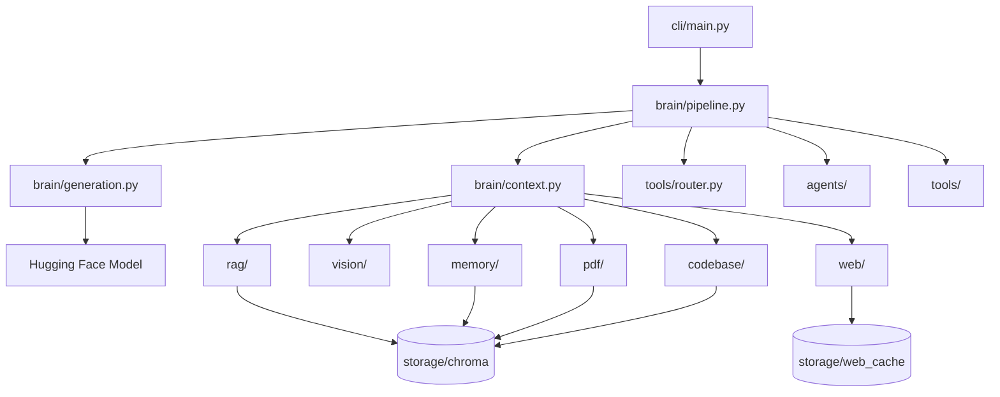

# Zoe AI Architecture

## System Overview

Zoe AI is a local-first personal assistant built around a Hugging Face chat model with tool-routed retrieval, web search, and vision analysis backed by ChromaDB.

## Folder Responsibilities

| Folder | Responsibility |
|--------|----------------|
| `brain/` | Chat pipeline, context building, model loading, generation |
| `cli/` | User commands: `chat`, `ingest`, `code`, `image`, `doctor`, `train` |
| `core/` | Config, Chroma helpers, logging, diagnostics, doctor, package checks |
| `rag/` | Personal notes loading, embedding, indexing, and search |
| `memory/` | Memory detection, storage, retrieval, conversation bridge |
| `conversation/` | Persistent dialogue storage, sessions, summarization, search |
| `pdf/` | PDF loading, chunking, indexing, and search |
| `codebase/` | Source code loading, chunking, indexing, and search |
| `web/` | Search, webpage reading, disk cache, retrieval pipeline |
| `vision/` | Image loading, OCR, captioning, unified analysis |
| `tools/` | Routing, calculator, datetime, filesystem execution |
| `agents/` | Agent orchestration: intent, planning, execution, recovery, verification, fusion |
| `config/` | Runtime settings in `settings.txt` |
| `data/` | Notes and PDF input files |
| `scripts/` | Smoke and integration test scripts |
| `tests/` | Pytest regression suite |

## ChromaDB Collections

| Collection | Purpose |
|------------|---------|
| `zoe_notes` | Personal notes from `data/notes/` |
| `zoe_memory` | Learned conversation memories |
| `zoe_history` | Searchable conversation dialogue |
| `zoe_documents` | Chunked PDF text |
| `zoe_code` | Chunked project source code |

All collections share the same database path via `core/chroma.py`.

## Zoe Desktop

PySide6 Qt Widgets application in `desktop/`:

| Module | Role |
|--------|------|
| `app.py` | Entrypoint, splash screen, high-DPI setup |
| `main_window.py` | Layout, sidebar actions, drag-and-drop |
| `workers.py` | Background threads for LLM, vision, indexing, doctor |
| `chat_widget.py` / `message_bubble.py` | Markdown chat UI |
| `history_panel.py` | Sprint 11 session browser |
| `settings_dialog.py` | Theme and backend path settings |

Desktop never imports business logic beyond existing backend modules.

## Voice Assistant

Offline voice frontend in `voice/`:

| Stage | Module |
|-------|--------|
| Capture + silence | `voice/listener.py`, `voice/audio.py` |
| STT | `voice/recognizer.py` (Whisper + SpeechRecognition fallback) |
| Think | `brain.pipeline.generate_response()` via `voice/commands.py` |
| Speak | `voice/speaker.py` (pyttsx3) |
| Orchestration | `voice/manager.py` |

Desktop integrates through `desktop/voice_widget.py` and `desktop/microphone_button.py`.

## Chat Pipeline

`brain/pipeline.generate_response()` executes in order:

1. Attempt memory save via `memory/store.py`
2. Execute lightweight tools via `tools/executor.py` (calculator, datetime, filesystem)
3. Run agent orchestration via `agents/orchestrator.py`:
   - Intent analysis (`agents/intent.py`)
   - Internal planning (`agents/planner.py`) — never shown to the user
   - Multi-tool execution with recovery (`agents/executor.py`, `agents/recovery.py`)
   - Retrieval fusion and ranking (`agents/fusion.py`)
   - Pre-generation verification (`agents/verifier.py`)
4. Handle vision requests via `vision/pipeline.analyze_image()` when an image path is detected
5. Return empty-index guidance for notes, PDF, or code when applicable
6. Build prompt sections via `brain/context.py` (system, conversation, memory, retrieved knowledge, web, vision, current task)
7. Generate LLM reply via `brain/generation.py`
8. Persist the exchange to `data/history/chat.jsonl`

DEBUG logs include intent, selected tools, execution order, recovery warnings, verification notes, and timings.

## Retrieval Flow

The agent layer may invoke **multiple** retrieval sources per message (memory, conversation, notes, PDF, code, web, vision, project analysis). Fusion ranks and deduplicates context in this priority order:

| Priority | Source |
|----------|--------|
| 1 | Memory |
| 2 | Conversation |
| 3 | Notes |
| 4 | PDF |
| 5 | Code |
| 6 | Vision |
| 7 | Web |

The legacy router in `tools/router.py` still provides the primary route hint for backward compatibility.

## Web Flow

1. `web/search.py` queries DuckDuckGo
2. `web/reader.py` downloads and cleans pages
3. `web/cache.py` stores page text on disk
4. `web/retriever.py` assembles bounded context with source metadata

## Vision Flow

1. `vision/loader.py` loads and normalizes images
2. `vision/caption.py` generates BLIP captions
3. `vision/ocr.py` extracts text via EasyOCR
4. `vision/pipeline.py` merges caption + OCR + metadata
5. `brain/context.py` injects vision context into the system prompt

## CLI Commands

| Command | Purpose |
|---------|---------|
| `python cli/main.py chat` | Interactive conversation |
| `python cli/main.py ingest` | Build notes and PDF indexes |
| `python cli/main.py code PROJECT_PATH` | Index project source code |
| `python cli/main.py image IMAGE_PATH` | Analyze an image directly |
| `python cli/main.py image IMAGE_PATH --prompt "..."` | Ask a question about an image |

## Model Caching

| Component | Cache location |
|-----------|----------------|
| LLM | `brain/generation.py` global singleton |
| Embeddings | `rag/embedder.py` global singleton |
| BLIP caption model | `vision/caption.py` global singleton |
| EasyOCR reader | `vision/ocr.py` global singleton |
| Chroma client | `core/chroma.py` global singleton |
| Web pages | `storage/web_cache/` SHA256 files |

## Stability Notes

- Shared Chroma helpers live in `core/chroma.py`
- Shared chunk deduplication lives in `core/indexing.py`
- Retrieval failures are logged and do not stop chat generation
- Startup diagnostics run at chat session start via `core/diagnostics.py`
- CI runs pytest via `.github/workflows/tests.yml`
