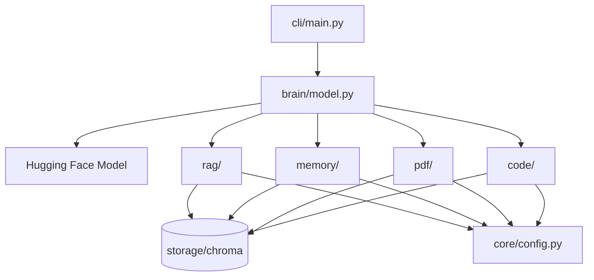

# Zoe AI Architecture

## System Overview

Zoe AI is a local-first personal assistant built around a Hugging Face chat model with multiple retrieval layers backed by ChromaDB.

## Folder Responsibilities

| Folder | Responsibility |
|--------|----------------|
| `brain/` | Model loading and chat generation |
| `cli/` | User commands: `chat`, `ingest`, `code`, `train` |
| `core/` | Shared config, Chroma helpers, logging, indexing utilities |
| `rag/` | Personal notes loading, embedding, indexing, and search |
| `memory/` | Memory detection, storage, and retrieval |
| `pdf/` | PDF loading, chunking, indexing, and search |
| `code/` | Source code loading, chunking, indexing, and search |
| `config/` | Runtime settings in `settings.txt` |
| `data/` | Notes and PDF input files |
| `scripts/` | Automated smoke and integration tests |

## ChromaDB Collections

| Collection | Purpose |
|------------|---------|
| `zoe_notes` | Personal notes from `data/notes/` |
| `zoe_memory` | Learned conversation memories |
| `zoe_documents` | Chunked PDF text |
| `zoe_code` | Chunked project source code |

All collections share the same database path via `core/chroma.py`.

## Data Flow

1. Source files are loaded from disk.
2. Text is chunked when needed.
3. Embeddings are generated through `rag/embedder.py`.
4. Vectors and metadata are stored in ChromaDB.
5. Queries are embedded and matched semantically at runtime.

## Retrieval Flow

During chat generation, `brain/model.py`:

1. Attempts to save personal statements through `memory.store.save_memory()`.
2. Retrieves notes, memories, PDF chunks, and code chunks in parallel.
3. Merges only non-empty sections into one bounded system context.
4. Sends the merged prompt to the local LLM.

## Memory Flow

1. `memory/detector.py` decides whether a message should be remembered.
2. `memory/store.py` saves accepted messages to `zoe_memory`.
3. Duplicate exact text is skipped.
4. `memory/retriever.py` searches stored memories during chat.

## PDF Flow

1. `pdf/loader.py` extracts text from `data/pdfs/`.
2. `pdf/chunker.py` splits text into overlapping chunks.
3. `pdf/indexer.py` stores chunks in `zoe_documents`.
4. `pdf/retriever.py` returns relevant chunks during chat or tests.

## Code Flow

1. `code/loader.py` scans a project directory recursively.
2. `code/chunker.py` splits files by class, function, method, or fallback size.
3. `code/indexer.py` stores chunks in `zoe_code`.
4. `code/retriever.py` returns relevant code during chat or tests.

## CLI Commands

| Command | Purpose |
|---------|---------|
| `python cli/main.py chat` | Interactive conversation |
| `python cli/main.py ingest` | Build notes and PDF indexes |
| `python cli/main.py code PROJECT_PATH` | Index a project's source code |

## Stability Notes

- Shared Chroma helpers live in `core/chroma.py`.
- Shared chunk deduplication lives in `core/indexing.py`.
- Context size is capped in `brain/model.py` to reduce prompt overflow.
- Retrieval failures are logged and do not stop chat generation.
