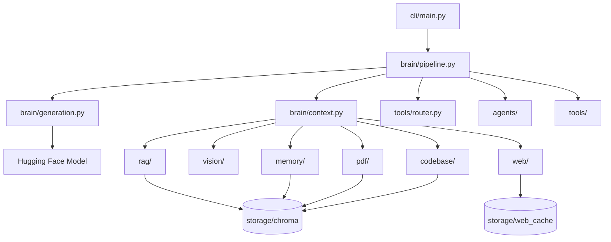
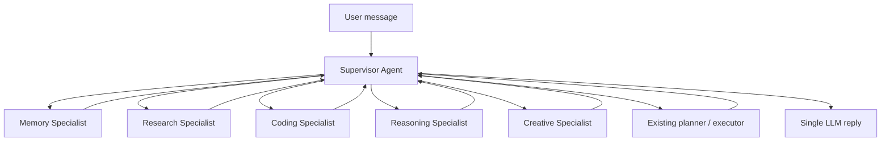
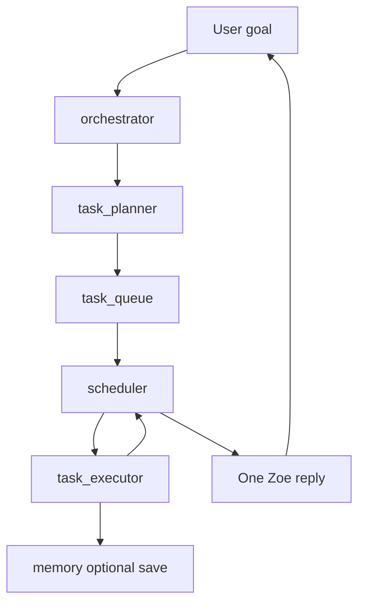
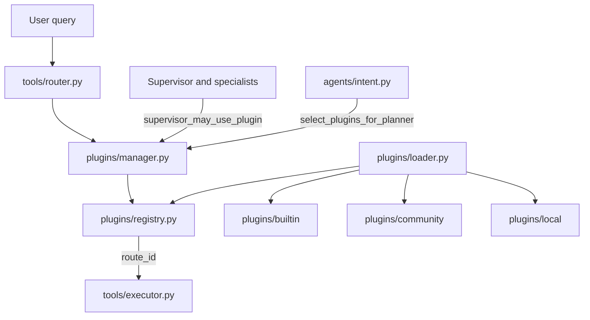

# Zoe AI Architecture

## System Overview

Zoe AI is a local-first personal assistant built around a Hugging Face chat model with tool-routed retrieval, web search, and vision analysis backed by ChromaDB.

## Folder Responsibilities

| Folder | Responsibility |
|--------|----------------|
| `brain/` | Chat pipeline, context building, model loading, generation |
| `cli/` | User commands: `chat`, `ingest`, `code`, `image`, `doctor`, `train` |
| `core/` | Config, Chroma helpers, logging, diagnostics, doctor, package checks |
| `rag/` | Personal notes loading, embedding, indexing, and search |
| `memory/` | Detection, storage, retrieval, and `memory/intelligence/` scoring pipeline |
| `conversation/` | Persistent dialogue storage, sessions, summarization, search |
| `pdf/` | PDF loading, chunking, indexing, and search |
| `codebase/` | Source code loading, chunking, indexing, and search |
| `web/` | Search, webpage reading, disk cache, retrieval pipeline |
| `vision/` | Image loading, OCR, captioning, unified analysis |
| `tools/` | Routing facade; executor; legacy vision/filesystem |
| `plugins/` | Registry, loader, lifecycle, permissions, sandbox, builtin plugins |
| `agents/` | Agent orchestration: intent, planning, execution, recovery, verification, fusion |
| `config/` | Runtime settings in `settings.txt` |
| `data/` | Notes and PDF input files |
| `scripts/` | Smoke and integration test scripts |
| `tests/` | Pytest regression suite |

## ChromaDB Collections

| Collection | Purpose |
|------------|---------|
| `zoe_notes` | Personal notes from `data/notes/` |
| `zoe_memory` | Learned conversation memories |
| `zoe_history` | Searchable conversation dialogue |
| `zoe_documents` | Chunked PDF text |
| `zoe_code` | Chunked project source code |

All collections share the same database path via `core/chroma.py`.

## Zoe Desktop

PySide6 Qt Widgets application in `desktop/`:

| Module | Role |
|--------|------|
| `app.py` | Entrypoint, splash screen, high-DPI setup |
| `main_window.py` | Layout, sidebar actions, drag-and-drop |
| `workers.py` | Background threads for LLM, vision, indexing, doctor |
| `chat_widget.py` / `message_bubble.py` | Markdown chat UI |
| `history_panel.py` | Sprint 11 session browser |
| `settings_dialog.py` | Theme and backend path settings |

Desktop never imports business logic beyond existing backend modules.

## Voice Assistant

Offline voice frontend in `voice/`:

| Stage | Module |
|-------|--------|
| Capture + silence | `voice/listener.py`, `voice/audio.py` |
| STT | `voice/recognizer.py` (Whisper + SpeechRecognition fallback) |
| Think | `brain.pipeline.generate_response()` via `voice/commands.py` |
| Speak | `voice/speaker.py` (pyttsx3) |
| Orchestration | `voice/manager.py` |

Desktop integrates through `desktop/voice_widget.py` and `desktop/microphone_button.py`.

## Chat Pipeline

`brain/pipeline.generate_response()` executes in order:

1. Attempt memory save via `memory/store.py`
2. Execute lightweight tools via `tools/executor.py` (calculator, datetime, filesystem)
3. Run agent orchestration via `agents/orchestrator.py`:
   - Intent analysis (`agents/intent.py`)
   - **Supervisor agent** (`agents/supervisor.py`) selects internal specialists (never shown to the user)
   - Specialist agents (`agents/specialists/`) gather structured `AgentResult` objects in parallel (`agents/coordinator.py`)
   - Internal planning (`agents/planner.py`) — never shown to the user
   - Multi-tool execution with recovery (`agents/executor.py`, `agents/recovery.py`)
   - Retrieval fusion and ranking (`agents/fusion.py`) plus merged specialist brief
   - Pre-generation verification (`agents/verifier.py`)
4. Handle vision requests via `vision/pipeline.analyze_image()` when an image path is detected
5. Return empty-index guidance for notes, PDF, or code when applicable
6. Build prompt sections via `brain/context.py` (system, conversation, memory, retrieved knowledge, web, vision, current task)
7. Generate LLM reply via `brain/generation.py`
8. Persist the exchange to `data/history/chat.jsonl`

DEBUG logs include intent, selected tools, execution order, recovery warnings, verification notes, and timings.

## Multi-Agent Reasoning (Internal)

The user always talks to **one Zoe**. Additional agents are internal only.

| Agent | Role |
|-------|------|
| Supervisor | Task decomposition, specialist selection, conflict resolution, merged brief |
| Memory | Memories, history, notes, user profile |
| Research | Web, PDFs, documentation, indexed code citations |
| Coding | Code search, architecture, debugging context |
| Reasoning | Comparisons, planning frames, evaluation structure |
| Creative | Writing, brainstorming, ideation frames |

Specialists exchange structured `AgentResult` objects (findings, citations, confidence). Simple prompts (for example calculator or short greetings) skip the supervisor entirely.

## Autonomous Task Engine

Long or multi-step goals (full project analysis, comprehensive improvement reports) enter the **task engine** before normal single-turn planning:

Subtasks use existing indexers, project analyzer, and code search. States: `pending`, `running`, `waiting`, `completed`, `failed`, `cancelled`, `paused`. DEBUG logs: task created → dependencies → execution → retries → completion summary.

## Plugin & Tool Flow

1. **Startup** — `initialize_plugins()` discovers plugins once from `plugins/builtin`, `plugins/community`, and `plugins/local`.
2. **Routing** — `PluginRegistry.resolve_route()` selects the highest-priority enabled plugin match; route lookups are cached.
3. **Execution** — Utility plugins (calculator, datetime) run `execute_query`; routing plugins expose `route_id` for retrieval layers.
4. **Permissions** — Declared capabilities are enforced via `supervisor_may_use_plugin()` (e.g. web requires `internet`).
5. **Recovery** — Plugin crashes set health to `crashed` and do not terminate the host process.
6. **Hot reload** — `reload_plugin()` re-imports a module without restarting Zoe.

### Extension packages (Sprint 20)

Manifest extensions live in `plugins/<package>/` with `plugin.json` and an entry module (typically `main.py`). They register through **`PluginContext`** only — no direct imports of Zoe internals.

| API | Purpose |
|-----|---------|
| `register_tool()` | Add routes to the existing tool router |
| `register_chat_hook()` | Append/annotate replies (core reply wins) |
| `register_memory_hook()` | Observe saves (requires `memory` permission) |
| `register_voice_hook()` | STT/TTS pipeline phases |
| `register_event()` | Subscribe to the plugin event bus |
| `storage()` | Isolated files under `data/plugins/<id>/` |

Extensions are **disabled by default**; enable via `python cli/main.py plugins enable <id>`. Builtin plugins remain enabled for backward compatibility.

Example packages: `plugins/example_clock/`, `example_notes/`, `example_translate/`.

## Production deployment (Sprint 21)

| Component | Path | Role |
|-----------|------|------|
| Config | `deployment/config.py` | Merge CLI → env → YAML → `settings.txt` |
| Startup | `deployment/startup.py` | Ordered init with DEBUG timings |
| Shutdown | `deployment/shutdown.py` | Tasks, models, plugins, events |
| Health | `deployment/health.py` | Subsystem checks for doctor |
| Resources | `deployment/resource_monitor.py` | Internal snapshot API |
| Telemetry | `deployment/telemetry.py` | Local JSONL under `data/telemetry/` |
| Benchmark | `deployment/benchmark.py` | Structured latency report |

Profiles (`ZOE_PROFILE`): **developer**, **production**, **portable**, **testing** — adjust logging, cache, telemetry, and diagnostic verbosity automatically.

## Memory Intelligence Flow

After each completed chat turn, `agents/orchestrator.finalize_conversation_memory()` invokes `memory/intelligence/memory_review.py`:

1. Resolve explicit or inferred candidate text (`detector` + `inference`)
2. **Forget filter** — skip small talk, weather, calculator/datetime (`forgetting.py`)
3. **Score** — importance, confidence, frequency, category (`memory_scoring.py`, `importance.py`, `memory_types.py`)
4. **Reinforce** — bump existing records instead of duplicating (`reinforcement.py`)
5. **Consolidate** — merge near-duplicate facts (`consolidation.py`)
6. **Store** — `save_scored_memory` / `update_scored_memory` in `memory/store.py`
7. **Review** — expire temporary entries, merge duplicates, refresh internal profile (`memory_review.py`, `profile_builder.py`)

Profile summary queries (*What do you know about me?*, *What have you learned?*) return `format_profile_summary_for_user()` without exposing the raw internal profile elsewhere.

## Retrieval Flow

The agent layer may invoke **multiple** retrieval sources per message (memory, conversation, notes, PDF, code, web, vision, project analysis). Fusion ranks and deduplicates context in this priority order:

| Priority | Source |
|----------|--------|
| 1 | Memory |
| 2 | Conversation |
| 3 | Notes |
| 4 | PDF |
| 5 | Code |
| 6 | Vision |
| 7 | Web |

`tools/router.py` classifies queries via the plugin registry, with legacy vision/filesystem fallback.

## Web Flow

1. `web/search.py` queries DuckDuckGo
2. `web/reader.py` downloads and cleans pages
3. `web/cache.py` stores page text on disk
4. `web/retriever.py` assembles bounded context with source metadata

## Vision Flow

1. `vision/loader.py` loads and normalizes images
2. `vision/caption.py` generates BLIP captions
3. `vision/ocr.py` extracts text via EasyOCR
4. `vision/pipeline.py` merges caption + OCR + metadata
5. `brain/context.py` injects vision context into the system prompt

## CLI Commands

| Command | Purpose |
|---------|---------|
| `python cli/main.py chat` | Interactive conversation |
| `python cli/main.py ingest` | Build notes and PDF indexes |
| `python cli/main.py code PROJECT_PATH` | Index project source code |
| `python cli/main.py image IMAGE_PATH` | Analyze an image directly |
| `python cli/main.py image IMAGE_PATH --prompt "..."` | Ask a question about an image |

## Model Caching

| Component | Cache location |
|-----------|----------------|
| LLM | `brain/generation.py` global singleton |
| Embeddings | `rag/embedder.py` global singleton |
| BLIP caption model | `vision/caption.py` global singleton |
| EasyOCR reader | `vision/ocr.py` global singleton |
| Chroma client | `core/chroma.py` global singleton |
| Web pages | `storage/web_cache/` SHA256 files |

## Stability Notes

- Shared Chroma helpers live in `core/chroma.py`
- Shared chunk deduplication lives in `core/indexing.py`
- Retrieval failures are logged and do not stop chat generation
- Startup diagnostics run at chat session start via `core/diagnostics.py`
- CI runs pytest via `.github/workflows/tests.yml`
